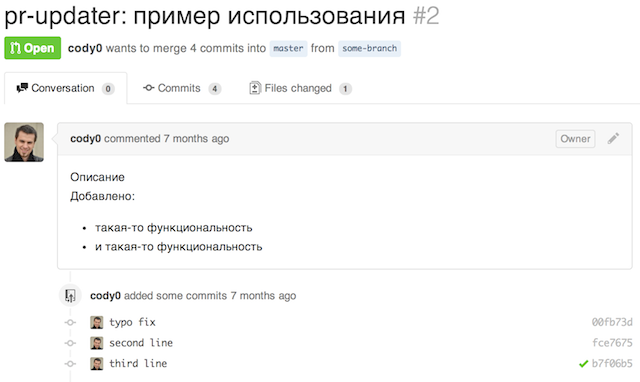
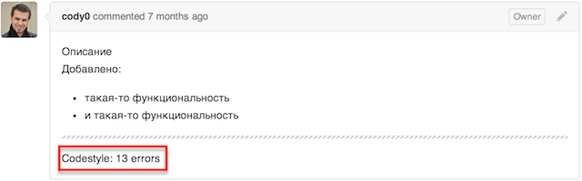
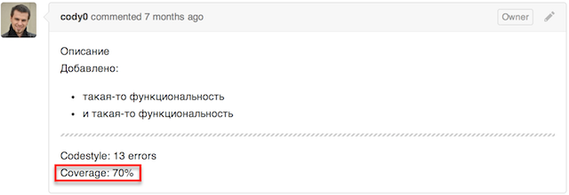
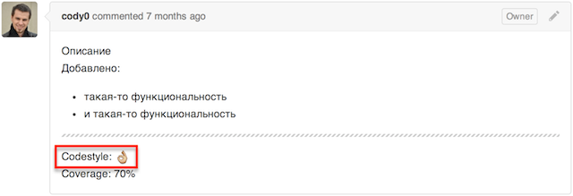
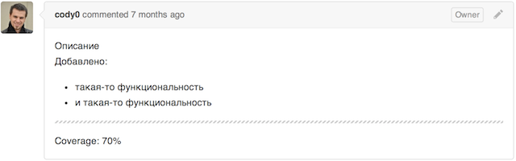
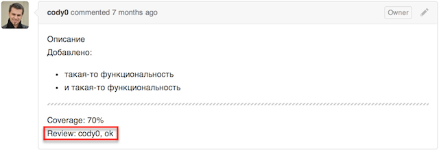
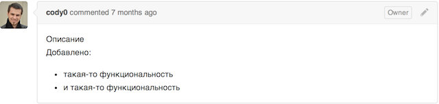

test-task-tools
===============

Тестовое задания на вакансию в группу разработки инструментов
## pr-updater

Написать модуль для обновления описания PR в репозитории на github'е. Модуль должен иметь интерфейс командной строки, а также библиотечный API.
С помощью интерфейса командной строки пользователь, находясь в директории склонированного репозитория, должен иметь возможность работать с отдельными секциями описания определенного PR, не затрагивая при этом всю остальную часть описания.

### Данные
  - номер PR, id секции и текст задаются в командной строке при вызове
  - адрес репозитория вычисляются из текущего окружения (можно запустить какую-нибудь команду или вычитать файл)
  - авторизационный токен должен вычитываться из конфигурационного файла, находящегося либо в рабочей директории либо в домашней директории пользователя

### Функциональность
  - добавить новую секцию
  - обновить существующую секцию
  - считать текст существующей секции
  - удалить секцию
  - удалить все секции


Библиотечный API должен обеспечивать возможность использования утилиты в качестве подключаемого модуля.

Основная функциональность должны быть покрыта unit-тестами.

## Пример
Допустим, есть Pull Request:



Добавляем секцию codestyle:

`$ pr-updater --pr 2 --section codestyle 'Codestyle: 13 errors'`


Добавляем секцию coverage:

`$ pr-updater --pr 2 --section coverage 'Coverage: 70%'`


Меняем текст в секции codestyle:

`$ pr-updater --pr 2 --section codestyle 'Codestyle: :ok_hand:'`


Выводим текст из секции codestyle:

```
$ pr-updater --pr 2 --section codestyle
> Codestyle: :ok_hand:
```

Удаляем секцию codestyle:

`$ pr-updater --pr 2 --section codestyle --delete`


Добавляем секцию review:

`$ pr-updater --pr 2 --section review 'Review: cody0, ok'`


Удаляем все добавленные ранне секции:

`$ pr-updater --pr 2 --clear`


## Полезные ссылки
 - https://developer.github.com/v3/
 - http://mochajs.org/

## Дополнительно
Если номер PR не указан в параметрах командной строки, утилита должна попытаться определить номер автоматически, исходя из названия текущей рабочей ветки (которое также можно узнать из окружения)
